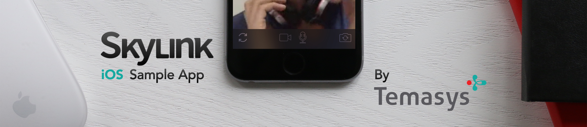

**Skylink** Sample App for **iOS**
==========================

**WebRTC** powered App
-------
WebRTC is **real-time audio, video and data exchange** for your **website and native app**.

With WebRTC browsers and apps learn to talk to each other instead of just to web servers. They can share audio and video streams from your microphone and camera, exchange files and images or just send and receive simple messages the fastest possible way: **peer-to-peer**.

**SkylinkSDK for iOS** demo
-------
Skylink is a cross platform solution for building WebRTC rich messaging applications. You also might want to check the Android and JavaScript SDKs on http://skylink.io.

*This sample application and its code is intended to demonstrate to developers usage samples of the Temasys's SkylinkSDK for iOS.*
> To use this sample app, you need to **get you API key** at http://developer.temasys.com.sg/register

This App has 5 distinct view controllers, each of them demonstrate how to build the following features:

- One to one video call
- Multi party video call
- Multi party audio call
- Chatroom and custom messages
- File transfers

**SkylinkSDK for iOS documentation:** http://skylink.io/ios/

----------

**Usage**
==========================
Installation
-------
> It is recommended to install the SDK via **cocoapods**, if you don't have it installed follow these steps:
>  - Check that you have Xcode command line tools installed (Xcode > Preferences > Locations > Command line tools). If not, open the terminal and run `xcode-select --install` ([more details here](http://osxdaily.com/2014/02/12/install-command-line-tools-mac-os-x/) if needed).
>  - Install cocoa pods in the terminal: `$ sudo gem install cocoapods`
>  
>  *Cocoapods website: [cocoapods.org](http://cocoapods.org).*

- Clone the repo or download the project.
- Run `pod install` .  
- Open the .xcworkspace file and run the universal app.

Code introduction
-------
The code should be self explanatory: each view controller works by itself and there is very few UI code thanks to Storyoard usage. 
In each view controller, the main idea is to **configure and instanciate a connection to a room with Skylink**. 
You will then be able to communicate with other peer joining the same room.

    // Creating configuration
    SKYLINKConnectionConfig *config = [SKYLINKConnectionConfig new];
    config.video = YES;
    config.audio = YES;
    config.dataChannel = YES;
    config.fileTransfer = YES;
    config.timeout = 30;
    config.userInfo = @{@"customKey" : customValue, ...};
    // Creating SKYLINKConnection
    self.skylinkConnection = [[SKYLINKConnection alloc] initWithConfig:config appKey:@"MY-KEY"];
    self.skylinkConnection.lifeCycleDelegate = self;
    self.skylinkConnection.mediaDelegate = self;
    self.skylinkConnection.remotePeerDelegate = self;
    self.skylinkConnection.messagesDelegate = self;
    self.skylinkConnection.fileTransferDelegate = self;
    // Connecting to a room
    [self.skylinkConnection connectToRoomWithSecret:@"MY-SECRET" roomName:@"A-ROOM-NAME" userInfo:nil];

You can then control what happens in to room by **sending messages to the `SKYLINKConnection` instance** (like triggering a file transfer request for example), and **respond to events by implementing the delegate methods** from the 5 protocols.
Always set at least the `lifeCycleDelegate`.

> **Checkout the documentation for the complete set of informations.  http://skylink.io/ios/**

Aditionally, in each view controller example's viewDidLoad/initWithCoder method, some properties are initialized.
A disconnect button is set in the navigation bar (left corner) as well as its selector implementation (called disconnect). An info button is set on the right corner, as well as its implementation (called showInfos). Those 2 navigation bar buttons selectors are the same in every VC example.

The rest of the example view controllers gives you 5 example usages of SkylinkSDK for iOS.

In what example view controller can I find **specific SkylinkSDK for iOS sample usages** ?
==========================
**SDK usage table for this sample App**
This table lists the complete set of the SDK elements as of version 1.0.8 and the view controllers of this sample App where you can find example usages.

In this table we use nicks to refer to the sample app's view controllers, here is the correspondance table:

| View controller's Nick | Corresponding View Controller (.m file) |
| 	-------:	| 	:--------	|
| **`1to1V`** |  VideoCallViewController | 
| **`MultiV`** |  MultiVideoCallViewController | 
| **`Audio`** |  AudioCallViewController | 
| **`Chat`** |  MessagesViewController | 
| **`File`** |  FileTransferViewController | 

**Classes** sample usages
-------
The following describes the **SKYLINKConnection** class usage. This is the most important class as it is the main place to control the SDK.

| 	***SKYLINKConnection*** | 	`1to1V`	| 	`MultiV `	| 	`Audio`	| 	`Chat`	| 	`File`	| 
| 	-------:	| 	:--------:	| 	:--------:	| 	:--------:	| 	:--------:	| 	:--------:	| 
| 	**Delegates**	| 	1to1V| 	MultiV 	| 	Audio	| 	Chat| 	File |
| 	  lifeCycleDelegate	| 	`✓`	| 	`✓`	| 	`✓`	| 	`✓`	| 	`✓`	| 
| 	  remotePeerDelegate	| 	`✓`	| 	`✓`	| 	`✓`	| 	`✓`	| 	`✓`	| 
| 	  mediaDelegate	| 	`✓`	| 	`✓`	| 	`✓`	| 		| 		| 
| 	  messagesDelegate	| 		| 		| 		| 	`✓`	| 		| 
| 	  fileTransferDelegate	| 		| 		| 		| 		| 	`✓`	| 
| 	**Peer Id**	| 	1to1V| 	MultiV 	| 	Audio	| 	Chat| 	File |
| 	  myPeerId	| 	`(✓)`			| 	`(✓)`			| 	`(✓)`			| 	`✓`	| 	`(✓)`			| 
| 	**Lifecycle**	| 	1to1V| 	MultiV 	| 	Audio	| 	Chat| 	File |
| 	- initWithConfig:appKey:	| 	`✓`	| 	`✓`	| 	`✓`	| 	`✓`	| 	`✓`	| 
| 	- connectToRoomWithSecret:roomName:userInfo:	| 	`✓`	| 	`✓`	| 		| 	`✓`	| 	`✓`	| 
| 	- connectToRoomWithCredentials:roomName:userInfo:	| 		| 		| 	`✓`	| 		| 		| 
| 	- disconnect:	| 	`✓`	| 	`✓`	| 	`✓`	| 	`✓`	| 	`✓`	| 
| 	**Room Control.**	| 	1to1V| 	MultiV 	| 	Audio	| 	Chat| 	File |
| 	- refreshConnection:	| 	`✓`	| 		| 		| 		| 		| 
| 	- lockTheRoom	| 	`(✓)`			| 	`✓`	| 		| 		| 		| 
| 	- unlockTheRoom	| 	`(✓)`			| 	`✓`	| 		| 		| 		| 
| 	**Media**	| 	1to1V| 	MultiV 	| 	Audio	| 	Chat| 	File |
| 	- muteAudio:	| 	`✓`	| 	`✓`	| 	`✓`	| 		| 		| 
| 	- muteVideo:	| 	`✓`	| 	`✓`	| 		| 		| 		| 
| 	- isAudioMuted	| 	`✓`	| 	`✓`	| 	`✓`	| 		| 		| 
| 	- isVideoMuted	| 	`✓`	| 	`✓`	| 		| 		| 		| 
| 	- switchCamera	| 	`✓`	| 	`✓`	| 		| 		| 		| 
| 	**Messaging**	| 	1to1V| 	MultiV 	| 	Audio	| 	Chat| 	File |
| 	- sendCustomMessage:peerId:	| 		| 		| 		| 	`✓`	| 		| 
| 	- sendDCMessage:peerId:	| 		| 		| 		| 	`✓`	| 		| 
| 	- sendBinaryData:peerId:	| 		| 		| 		| 	`✓`	| 		| 
| 	**File Transfer**	| 	1to1V| 	MultiV 	| 	Audio	| 	Chat| 	File |
| 	- sendFileTransferRequest:assetType:peerId:	| 		| 		| 		| 		| 	`✓`	| 
| 	- sendFileTransferRequest:assetType:	| 		| 		| 		| 		| 	`✓`	| 
| 	- acceptFileTransfer:filename:peerId:	| 		| 		| 		| 		| 	`✓`	| 
| 	- cancelFileTransfer:peerId:	| 		| 		| 		| 		| 	`✓`	| 
| 	**Miscellaneous**	| 	1to1V| 	MultiV 	| 	Audio	| 	Chat| 	File |
| 	- sendUserInfo:	| 		| 		| 		| 	`✓`	| 		| 
| 	- getUserInfo:	| 		| 		| 		| 		| 		| 
| 	**Utility**| 	1to1V| 	MultiV 	| 	Audio	| 	Chat| 	File |
| 	+ getSkylinkVersion	| 	`✓`	| 	`✓`	| 	`✓`	| 	`✓`	| 	`✓`	| 
| 	+ setVerbose:	| 	`✓`	| 	`✓`	| 	`✓`	| 	`✓`	| 	`✓`	| 
| 	+ calculateCredentials:duration:startTime\:secret \:	| 		| 		| 	`✓`	| 		| 		| 

The **SKYLINKConnectionConfig** is the class used to configure a newly created `SKYLINKConnection` instance.

| 	***SKYLINKConnectionConfig*** | 	`1to1V`	| 	`MultiV `	| 	`Audio`	| 	`Chat`	| 	`File`	| 
| 	-------:	| 	:--------:	| 	:--------:	| 	:--------:	| 	:--------:	| 	:--------:	| 
| 	  audio	| 	`✓`	| 	`✓`	| 	`✓`	| 	.	| 	.	| 
| 	  video	| 	`✓`	| 	`✓`	| 	.	| 	.	| 	.	| 
| 	  dataChannel	| 		| 		| 		| 	`✓`	| 	`✓`	| 
| 	  fileTransfer	| 		| 		| 		| 	.	| 	`✓`	| 
| 	  timeout	| 		| 		| 		| 		| 	`✓`	| 
| 	  userInfo	| 		| 		| 		| 		| 		| 

The **SKYLINKPeerMediaProperties** class is the type of the property list returned in the `metaProperties` parameter in `- connection:didJoinPeer:mediaProperties:peerId:`	delegate method from the `SKYLINKConnectionRemotePeerDelegate`.

| 	***SKYLINKPeerMediaProperties*** | 	`1to1V`	| 	`MultiV `	| 	`Audio`	| 	`Chat`	| 	`File`	| 
| 	-------:	| 	:--------:	| 	:--------:	| 	:--------:	| 	:--------:	| 	:--------:	| 
| 	 hasAudio	| 		| 		| 		| 		| 		| 
| 	  isAudioStereo	| 		| 		| 		| 		| 		| 
| 	  isAudioMuted	| 		| 	`✓`	| 	`✓`	| 		| 		| 
| 	  hasVideo	| 		| 		| 		| 		| 		| 
| 	  isVideoMuted	| 		| 	`✓`	| 		| 		| 		| 
| 	  videoWidth	| 		| 	`✓`	| 		| 		| 		| 
| 	  videoHeight	| 		| 	`✓`	| 		| 		| 		| 
| 	  videoFrameRate	| 		| 		| 		| 		| 		| 

**Protocols**  sample usages
-------
After setting the `SKYLINKConnection` delegates, you need to implement the corresponding delegate methods to react to events.

| 	***Protocols*** | 	`1to1V`	| 	`MultiV `	| 	`Audio`	| 	`Chat`	| 	`File`	| 
| 	-------:	| 	:--------:	| 	:--------:	| 	:--------:	| 	:--------:	| 	:--------:	| 
| 	**SKYLINKConnectionFileTransferDelegate**	| 	1to1V| 	MultiV 	| 	Audio	| 	Chat| 	File |
| 	- connection:didReceiveRequest:peerId:	| 		| 		| 		| 		| 	`✓`	| 
| 	- connection:didReceivePermission:filename:peerId:	| 		| 		| 		| 		| 	`✓`	| 
| 	- connection:didDropTransfer:reason:isExplicit:peerId:	| 		| 		| 		| 		| 	`✓`	| 
| 	- connection:didCompleteTransfer:fileData:peerId:	| 		| 		| 		| 		| 	`✓`	| 
| 	**SKYLINKConnectionLifeCycleDelegate**	| 	1to1V| 	MultiV 	| 	Audio	| 	Chat| 	File |
| 	- connection:didConnectWithMessage:success:	| 	`✓`	| 	`✓`	| 	`✓`	| 	`✓`	| 	`✓`	| 
| 	- connection:didRenderUserVideo:	| 	`✓`	| 	`✓`	| 		| 		| 		| 
| 	- connection:didLockTheRoom:peerId:	| 		| 	`✓`	| 		| 		| 		| 
| 	- connection:didReceiveWarning:	| 		| 		| 		| 		| 		| 
| 	- connection:didDisconnectWithMessage:	| 	`✓`	| 	`✓`	| 	`✓`	| 	`✓`	| 	`✓`	| 
| 	**SKYLINKConnectionMediaDelegate**	| 	1to1V| 	MultiV 	| 	Audio	| 	Chat| 	File |
| 	- connection:didChangeVideoSize:videoView:	| 	`✓`	| 	`✓`	| 		| 		| 		| 
| 	- connection:didToggleAudio:peerId:	| 		| 	`✓`	| 	`✓`	| 		| 		| 
| 	- connection:didToggleVideo:peerId:	| 		| 	`✓`	| 		| 		| 		| 
| 	**SKYLINKConnectionMessagesDelegate**	| 	1to1V| 	MultiV 	| 	Audio	| 	Chat| 	File |
| 	- connection:didReceiveCustomMessage:public:peerId:	| 		| 		| 		| 	`✓`	| 		| 
| 	- connection:didReceiveDCMessage:public:peerId:	| 		| 		| 		| 	`✓`	| 		| 
| 	- connection:didReceiveBinaryData:peerId:	| 		| 		| 		| 	`✓`	| 		| 
| 	**SKYLINKConnectionRemotePeerDelegate**| 	1to1V| 	MultiV 	| 	Audio	| 	Chat| 	File |
| 	- connection:didJoinPeer:mediaProperties:peerId:	| 	`✓`	| 	`✓`	| 	`✓`	| 	`✓`	| 	`✓`	| 
| 	- connection:didRenderPeerVideo:peerId:	| 	`✓`	| 	`✓`	| 		| 		| 		| 
| 	- connection:didReceiveUserInfo:peerId:	| 		| 		| 		| 	`✓`	| 		| 
| 	- connection:didLeavePeerWithMessage:peerId:	| 	`✓`	| 	`✓`	| 	`✓`	| 	`✓`	| 	`✓`	| 

----------

**Resources**
==========================

Support portal
-------
 If you encounter any issues or have any enquiries regarding Skylink, drop us a note on our [support portal](http://support.temasys.com.sg/support/login) and we would be happy to help! 

Tutorials
-------

Handle the video view stretching: http://temasys.com.sg/a-simple-solution-for-video-stretching/

Skylink, by **Temasys**
-------

Check our company websites:
- **Skylink**: http://skylink.io
- By **Temasys**: http://temasys.com.sg
Also checkout our Skylink SDKs for [Web](http://skylink.io/web/) and [Android](http://skylink.io/android)

Other library used (via cocoapods)
-------

- UIAlertView-Blocks: https://github.com/jivadevoe/UIAlertView-Blocks

----------

*This document was edited for SkylinkSDK for iOS version 1.0.8*

----------

